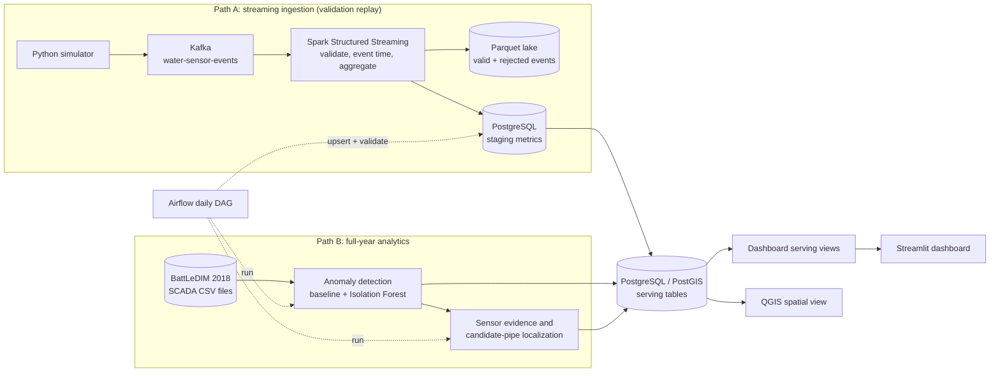
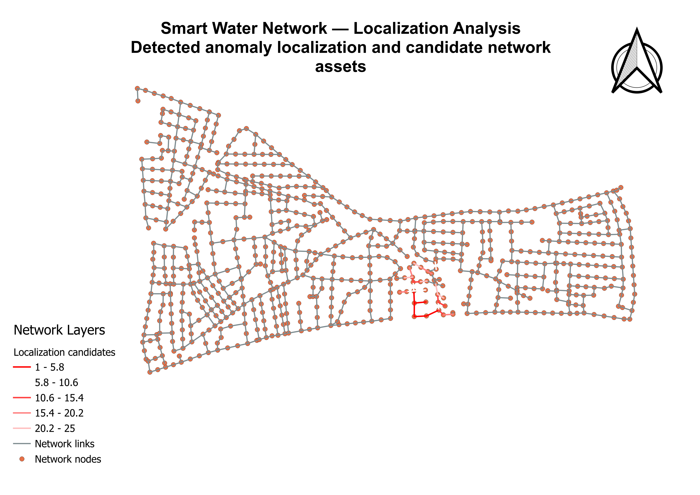
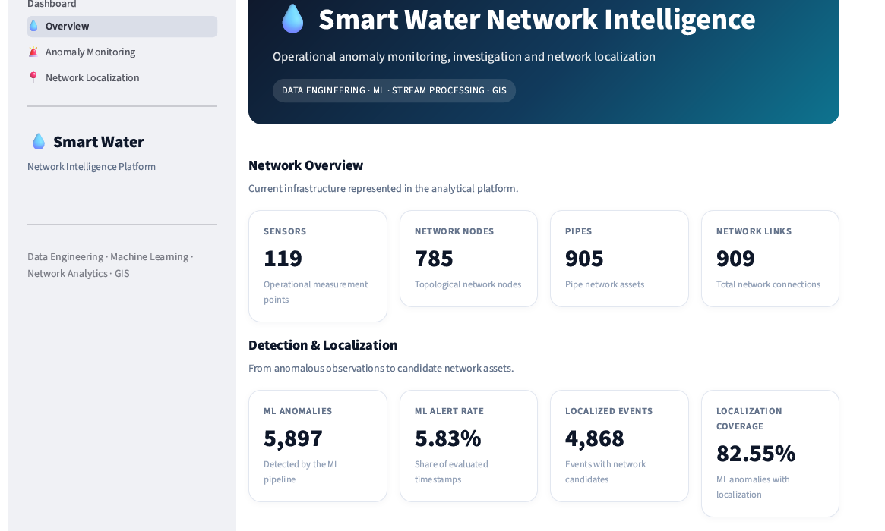

# Smart Water Network Intelligence Platform

An end-to-end **data engineering, machine-learning, network analytics,
and GIS platform** for processing water-distribution sensor data,
detecting abnormal network behaviour, interpreting sensor evidence,
ranking candidate network assets, and presenting operational
intelligence through an interactive dashboard.

> **Important:** This is a simulation/benchmark project using the
> BattLeDIM 2018 / L-Town water-network dataset. It is **not a live
> monitoring system for a real Rwandan water network**, and anomaly
> results must not be interpreted as confirmed leaks.

## Contents

1. [Project Overview](#1-project-overview)
2. [Architecture](#2-architecture)
3. [Data Source and Simulation Model](#3-data-source-and-simulation-model)
4. [Streaming Data Pipeline](#4-streaming-data-pipeline)
5. [Network Anomaly Detection](#5-network-anomaly-detection)
6. [Interpretation, Localization and GIS](#6-interpretation-localization-and-gis)
7. [Operational Analytics Dashboard](#7-operational-analytics-dashboard)
8. [Airflow Orchestration](#8-airflow-orchestration)
9. [End-to-End Validation](#9-end-to-end-validation)
10. [Data Quality and Testing](#10-data-quality-and-testing)
11. [Technology Stack](#11-technology-stack)
12. [Project Structure](#12-project-structure)
13. [Local Setup](#13-local-setup)
14. [Known Limitations](#14-known-limitations)
15. [Engineering Principles](#15-engineering-principles)
16. [Project Progress and Roadmap](#16-project-progress-and-roadmap)
17. [Current Capabilities](#17-current-capabilities)
18. [Reproducibility and Version Control](#18-reproducibility-and-version-control)
19. [Author](#19-author)

## 1. Project Overview

The platform demonstrates a complete engineering workflow across
ingestion, processing, storage, orchestration, analytics, localization,
GIS, and presentation:



The streaming path (A) and the analytics path (B) are **separate
workloads**: the full-year anomaly detection reads the BattLeDIM CSV
files directly, while the streaming path processes a controlled replay
of the same data through Kafka and Spark. Both are described in detail
below, and the consequences are listed under
[Known Limitations](#14-known-limitations).

## 2. Architecture

### Data Paths

| Path | Input | Processing | Output |
|---|---|---|---|
| **A: Streaming ingestion** | Simulated sensor events (a replay of 12 timestamps, 1,428 events) | Kafka, then Spark Structured Streaming with validation, event-time windows and a watermark | Parquet lake, PostgreSQL staging metrics, then serving metrics |
| **B: Analytics** | Full-year BattLeDIM 2018 SCADA CSV files (105,120 timestamps x 119 sensors) | Causal feature engineering, baseline and Isolation Forest detection, sensor evidence, topology-based localization | PostgreSQL / PostGIS anomaly and localization tables |
| **Serving** | PostgreSQL tables | Dashboard views and the QGIS view | Streamlit dashboard, QGIS project |

Apache Airflow runs a daily workflow that upserts the streaming metrics,
validates reference data, executes the analytics path in a container
(`smart-water-ml`), and validates every result. It does **not** start
the simulator, Kafka or Spark; those steps are run manually
(see [Airflow Orchestration](#8-airflow-orchestration)).

### Architecture Illustration


*This illustration is a simplified overview. The diagram in
[Section 1](#1-project-overview) shows the exact data paths.*

### Component Responsibilities

| Component | Responsibility |
|---|---|
| Python | Sensor simulation, feature engineering, anomaly analysis, localization |
| Apache Kafka | Streaming sensor-event ingestion |
| Apache Spark | Validation, event-time processing, aggregation, persistence |
| Parquet | Historical valid-event storage and rejected-event quarantine |
| PostgreSQL | Operational, analytical, serving, anomaly, and localization data |
| PostGIS | Network geometry and spatial serving |
| Apache Airflow | Scheduling, orchestration, retries, and validation |
| scikit-learn | Isolation Forest anomaly detection |
| Network topology | Sensor-to-network attribution and candidate-pipe ranking |
| QGIS | Spatial investigation of localization results |
| Streamlit | Interactive operational analytics dashboard |
| Docker | Reproducible infrastructure and execution environments |
| pytest | Automated tests for the data contract and analytical logic |
| Git / GitHub | Version control and project publication |

## 3. Data Source and Simulation Model

The project uses the **BattLeDIM 2018 historical dataset** together with
the **L-Town EPANET water-distribution network model**. The dataset
comes from the *Battle of the Leakage Detection and Isolation Methods*
(BattLeDIM) 2020 competition; see the
[official BattLeDIM website](http://battledim.ucy.ac.cy/) and the
[KIOS Research BattLeDIM repository](https://github.com/KIOS-Research/BattLeDIM).

L-Town is a benchmark network and should not be interpreted as a real
Rwandan water network.

### SCADA Measurements

| Measurement | Sensors | Unit |
|---|---:|---|
| Pressure | 33 | m |
| Flow | 3 | m3/h |
| Tank level | 1 | m |
| Demand | 82 | L/h |
| **Total** | **119** | |

The 2018 SCADA data contains **105,120 timestamps at 5-minute
intervals**, with 119 measurements at each timestamp, which is about
12.5 million readings.

### Network Reference Data

```text
Sensors          119
Network nodes    785
Network links    909
Pipes            905
Pump               1
Valves             3
```

All 119 sensors are mapped to network assets. The source network uses
the BattLeDIM/L-Town **local model coordinate system (SRID 0)**; no
unsupported geographic CRS is assigned.

Known leakage information is kept separate from detector and
localization inputs and is used for evaluation rather than model
training or threshold tuning.

Raw source data is preserved unchanged and excluded from Git. See
[Local Setup](#13-local-setup) for where to place it.

## 4. Streaming Data Pipeline

The Python simulator converts historical SCADA observations into
chronological sensor events and publishes them to the Kafka topic:

```text
water-sensor-events
```

### Event Contract

Every event carries these fields, and the simulator and Spark both
validate them:

| Field | Description |
|---|---|
| `event_id` | Deterministic ID: `{sensor_type}_{sensor_id}_{YYYYMMDDTHHMMSS}` |
| `event_time` | ISO-8601 timestamp of the measurement |
| `sensor_id` | Sensor identifier (node or link ID) |
| `sensor_type` | `pressure`, `flow`, `level` or `demand` |
| `value` | Numeric measurement |
| `unit` | `m`, `m3/h`, `m` or `L/h`, respectively |

### Spark Structured Streaming

Spark runs as a micro-batch job (`availableNow` trigger) and performs:

```text
Kafka ingestion
      |
      v
JSON parsing
      |
      v
Schema validation
      |
      v
Structural validation
      |
      v
Event-time processing
      |
      v
10-minute watermark
      |
      v
15-minute sensor aggregation
      |
      +-------------> Parquet
      |
      v
PostgreSQL persistence
```

A controlled validation replay processed:

```text
1,428 sensor events
1,428 valid historical events
0 rejected events
476 staging metrics
476 serving metrics
```

Repeated serving-layer execution remained at **476 records**,
demonstrating idempotent persistence for the validated workload.

### Idempotent Parquet Lake

Because `event_id` is deterministic, replaying the simulator or
resetting a Spark checkpoint re-delivers identical events. Before
appending to the Parquet lake, the Spark job removes duplicates inside
the batch and drops events whose `event_id` is already stored, so the
**first stored copy is kept**. This behaviour is covered by an automated
test (see [Data Quality and Testing](#10-data-quality-and-testing)).

## 5. Network Anomaly Detection

The platform includes network-level anomaly intelligence built from two
complementary detectors. Both read the full-year BattLeDIM SCADA data
(Path B).

### Statistical Baseline

The explainable baseline uses causal weekly-deviation statistics. A
sensor is considered abnormal when:

```text
|z-score| >= 3
```

A network anomaly is triggered when at least:

```text
15 of 119 sensors
```

are simultaneously abnormal. The z-score of each observation is
calculated from earlier observations only, after a 7-day calibration
period.

Validated result:

```text
Anomaly timestamps    1,128
Anomaly rate           1.12%
```

### Isolation Forest

The unsupervised model uses 357 causal features:

```text
119 x 5-minute changes
119 x 1-hour changes
119 x weekly deviations
```

Configuration:

```text
n_estimators = 200
contamination = "auto"
random_state = 42
```

The anomaly threshold is fixed from the **99th percentile of
training-period scores**, without using future scoring data or leakage
labels.

Validated result:

```text
Threshold             0.521368
Anomaly timestamps       5,897
Anomaly rate               5.83%
```

### Ground-Truth Evaluation

Both detectors were evaluated against **14 known BattLeDIM leakage
events**.

| Evaluation | Baseline | Isolation Forest |
|---|---:|---:|
| Anomaly timestamps | 1,128 | 5,897 |
| Anomaly rate | 1.12% | 5.83% |
| Alert within 24 h | 8 / 14 | 13 / 14 |
| Alert within 72 h | 12 / 14 | 14 / 14 |
| Mean first-alert delay | 30.08 h | 7.10 h |
| Median first-alert delay | 15.50 h | 4.79 h |
| Maximum first-alert delay | 107.25 h | 33.00 h |

The results demonstrate an operational trade-off between earlier warning
and alert volume. They are not presented as evidence that one detector
is universally superior.

## 6. Interpretation, Localization and GIS

This layer extends anomaly detection into interpretable network
decision support.

The objective is to move from:

```text
"An anomaly exists"
```

toward:

```text
"Which sensors explain the anomaly,
and which parts of the network should be investigated?"
```

### Sensor-Level Interpretation

Isolation Forest provides a network-level anomaly score but does not
directly identify the responsible sensor. The localization layer
therefore uses causal statistical sensor evidence to identify abnormal
measurements.

```text
Detection
    |
    v
Interpretation
    |
    v
Localization
```

### Sensor-to-Network Attribution

The physical network is represented as a graph using its nodes and
links. The localization system implements:

- sensor-to-node/link mapping;
- graph construction;
- shortest-hop distance calculation;
- cached topology distances;
- node/link sensor attribution.

### Candidate Pipe Localization

Candidate pipes are ranked using a transparent heuristic combining
sensor abnormality and network distance:

```text
                 |sensor z-score|
contribution = --------------------
                1 + topology distance
```

The system persists the **Top 25 candidate pipes** for each localizable
ML anomaly timestamp.

The ranking is an investigation aid. It is **not interpreted as the
probability that a pipe is leaking**.

### Localization Evaluation

| Metric | Result |
|---|---:|
| Known leakage events | 14 |
| Localization available | 13 / 14 |
| Exact Top-1 matches | 0 |
| Top-5 matches | 0 |
| Top-10 matches | 0 |
| Top-25 matches | 4 |
| Median true-pipe rank | 160 |
| Median Rank-1 distance to true pipe | 25 network hops |

The evaluation shows that the current topology-weighted heuristic can
produce candidate network assets, but it is not reliable enough for
exact-pipe leak localization. This limitation is explicitly documented
rather than overstating model performance.

### GIS Integration

Localization results are joined to PostGIS network geometry through the
QGIS serving view.

The QGIS project visualizes:

- the complete pipe network;
- anomaly-specific candidate pipes;
- candidate rank;
- Top-5 candidate labels.

Because the source network uses local/model coordinates, the
visualization intentionally avoids assigning an unsupported geographic
CRS.

### QGIS Map Preview



## 7. Operational Analytics Dashboard

The platform includes an interactive **Streamlit operational analytics
layer** on top of the validated PostgreSQL serving data.

The dashboard is a decision-support interface rather than a replacement
for the analytical pipeline.

### Dashboard Structure

```text
Smart Water Network Intelligence
|
+-- Network Overview
|   +-- 119 monitored sensors
|   +-- 785 network nodes
|   +-- 909 network links
|   +-- 905 pipes
|
+-- Anomaly Monitoring
|   +-- anomaly totals
|   +-- ML anomaly rate
|   +-- baseline anomaly activity
|   +-- anomaly timeline
|   +-- investigation filters
|   +-- selected-event evidence
|
+-- Network Localization
    +-- localized anomaly count
    +-- localization coverage
    +-- candidate-pipe activity
    +-- selected anomaly timestamp
    +-- ranked candidate network assets
```

### Dashboard Serving Layer

Dashboard-specific PostgreSQL views are created in:

```text
sql/06_create_dashboard_views.sql
```

The views are:

```text
dashboard_anomaly_daily
dashboard_anomaly_detail
dashboard_localization_summary
dashboard_localization_candidates
```

This creates a clean serving boundary between analytical tables and
dashboard queries.

### Validated Dashboard Results

#### Network

```text
Sensors          119
Network nodes    785
Network links    909
Pipes            905
```

#### Anomaly Intelligence

```text
Scored timestamps             101,088
ML anomaly timestamps           5,897
ML anomaly rate                   5.83%
Baseline anomaly timestamps      1,128
Baseline anomaly rate              1.12%
```

Analysis period:

```text
2018-01-15 -> 2018-12-31
```

#### Localization Intelligence

```text
ML anomaly timestamps          5,897
Localized timestamps           4,868
Unlocalized anomalies          1,029
Localization coverage         82.55%
Localization records        121,700
Distinct candidate pipes        495
Candidates per localized event   25
```

The dashboard includes daily anomaly activity. The highest ML anomaly
activity in the validated daily dataset occurred on **2018-07-19**, with
76 ML anomaly timestamps and a 26.39% daily ML anomaly rate. Other
high-activity periods occurred during May-August 2018.

These results indicate periods of elevated detected anomaly activity.
They do not by themselves establish the physical cause of the anomalies.

### Dashboard Implementation

```text
dashboard/
├── app.py
├── app_overview.py
├── db.py
├── queries.py
├── components/
│   ├── styles.py
│   └── __init__.py
└── pages/
    ├── 1_Anomaly_Monitoring.py
    └── 2_Network_Localization.py
```

The application connects to PostgreSQL through SQLAlchemy and uses
dedicated query functions for the dashboard serving views.

### Run Locally

From the project root:

```cmd
streamlit run dashboard\app.py
```

The dashboard normally opens at <http://localhost:8501>.

The dashboard is not yet publicly deployed (see
[Roadmap](#16-project-progress-and-roadmap)). A public deployment can be
added later without changing the analytical architecture, and it will
expose the same simulated/benchmark results, not live utility-network
telemetry.

### Dashboard Preview



## 8. Airflow Orchestration

The daily Airflow workflow (`smart_water_daily_pipeline`) orchestrates
the serving, anomaly-detection, and localization steps:

```text
check_postgresql
      |
      v
upsert_sensor_metrics
      |
      v
validate_metric_load
      |
      v
validate_reference_data
      |
      v
run_anomaly_detection
      |
      v
validate_anomaly_results
      |
      v
run_localization
      |
      v
validate_localization_results
```

Configuration:

```text
schedule      @daily
retries       2
retry delay   5 minutes
catchup       False
```

### How the workflow runs

- `run_anomaly_detection` and `run_localization` start the
  `smart-water-ml` Docker image through the Docker socket mounted into
  the Airflow scheduler. The image must be built once (see
  [Local Setup](#13-local-setup)).
- The host path of the repository is supplied through the
  `SMART_WATER_PROJECT_PATH` environment variable, so no machine-specific
  path is stored in source code.
- The DAG begins at the metrics upsert. The simulator, Kafka and Spark
  are started separately, because the schedule orchestrates the
  serving and analytics steps and does not imply that Kafka itself only
  processes data once per day.

## 9. End-to-End Validation

The final analytical workflow was validated through PostgreSQL and
Airflow.

| Validation | Result |
|---|---:|
| Anomaly rows | 101,088 |
| ML anomaly timestamps | 5,897 |
| Localization rows | 121,700 |
| Localized timestamps | 4,868 |
| Distinct candidate pipes | 495 |
| Invalid Top-25 groups | 0 |
| Localization without ML anomaly | 0 |
| Missing network links | 0 |
| Non-pipe candidates | 0 |
| Missing geometries | 0 |
| Duplicate timestamp/pipe pairs | 0 |
| NULL localization scores | 0 |
| Negative localization scores | 0 |
| QGIS view rows | 121,700 |
| Unique QGIS feature IDs | 121,700 |

Validated analytical chain (Path B and serving):

```text
BattLeDIM SCADA CSV files
    |
    v
Causal Feature Engineering
    |
    v
Anomaly Detection (baseline + Isolation Forest)
    |
    v
Sensor Evidence
    |
    v
Topology Attribution
    |
    v
Candidate Pipe Ranking
    |
    +-------------> PostGIS / QGIS
    |
    v
Dashboard Serving Views
    |
    v
Streamlit Dashboard
```

The streaming path (Path A) was validated separately, as described in
[Section 4](#4-streaming-data-pipeline).

## 10. Data Quality and Testing

### Automated Tests

The pytest suite covers pure-Python logic and needs no running services:

| Test module | What it protects |
|---|---|
| `test_simulator_contract.py` | The event contract: required fields, units per sensor type, deterministic `event_id`, batch uniqueness |
| `test_feature_engineering.py` | Time features, 5-minute, hourly and weekly lags, removal of warm-up rows |
| `test_baseline_detector.py` | Causal z-scores (no look-ahead, a reading is excluded from its own baseline), evidence counting, pinned detection thresholds |
| `test_quality_checks.py` | Every data-quality rule, and consistency between the quality rules, simulator and detector constants |

A separate Spark test, `tests/test_lake_dedup.py`, verifies the
idempotent Parquet write. It needs Spark, so it runs inside the Spark
container.

Install the development dependencies and run the suite from the project
root:

```cmd
pip install -r requirements-dev.txt
python -m pytest
```

Run the Spark de-duplication test (Docker Desktop running):

```cmd
docker run --rm -v "%cd%:/opt/project:ro" -w /opt/project apache/spark:4.1.3-scala2.13-java17-python3-ubuntu /opt/spark/bin/spark-submit --conf spark.jars.ivy=/tmp/.ivy2 tests/test_lake_dedup.py
```

### Parquet Lake Quality Checks

`src/data/quality_checks.py` evaluates the Parquet lake against explicit
rules. Each rule is an **ERROR** (the run exits with code 1) or a
**WARNING** (reported, never fails the run).

| Check | Severity | What it catches |
|---|---|---|
| `rows_present` | ERROR | Empty lake |
| `event_id_unique` | ERROR | Duplicate events |
| `required_columns_not_null` | ERROR | Missing event ID, time, sensor, type, value or unit |
| `values_finite` | ERROR | NaN or infinite readings |
| `sensor_type_known` | ERROR | Unrecognized sensor types |
| `unit_matches_sensor_type` | ERROR | Wrong unit for a sensor type |
| `values_non_negative` | ERROR | Negative pressure, flow, level or demand |
| `timestamps_complete` | ERROR | Any timestamp with fewer or more than 119 events (partial or doubled batches) |
| `values_within_plausible_range` | WARNING | Readings above generous physical limits |

The plausible-range limits (pressure 100 m, flow 500 m3/h, level 10 m,
demand 100,000 L/h) are deliberately generous. The 2018 data peaks far
below them, so they only flag clearly implausible readings.

Run the checks (Docker Desktop running):

```cmd
docker run --rm -v "%cd%:/opt/project:ro" -w /opt/project apache/spark:4.1.3-scala2.13-java17-python3-ubuntu /opt/spark/bin/spark-submit --conf spark.jars.ivy=/tmp/.ivy2 src/data/quality_checks.py
```

A different Parquet directory can be passed as a final argument. For a
lake without problems every check reports `[PASS]` and the run ends with
`QUALITY CHECKS PASSED.`

### Validation inside the pipeline

In addition to the checks above:

- Spark validates event structure and quarantines rejected events;
- the Airflow DAG validates metrics, reference data, anomaly results and
  localization results with SQL checks between stages;
- SQL constraints and idempotent upserts protect the serving tables.

The Parquet quality checks are currently run manually; they are not
yet an Airflow task.

## 11. Technology Stack

| Technology | Role |
|---|---|
| Python (3.14 locally, 3.13 in the ML container) | Simulation, feature engineering, anomaly detection, localization |
| Pandas / NumPy | Data transformation and analytical processing |
| scikit-learn | Isolation Forest |
| Apache Kafka 4.1.1 | Streaming ingestion |
| Apache Spark 4.1.3 | Structured streaming and aggregation |
| PostgreSQL / PostGIS | Operational, analytical, and spatial storage |
| Parquet | Historical event storage |
| Apache Airflow 3.3.1 | Workflow orchestration and validation |
| Streamlit | Operational analytics dashboard |
| QGIS 3.44 | Network and localization visualization |
| Docker / Docker Compose | Reproducible infrastructure |
| pytest | Automated tests |
| Git / GitHub | Version control and project publication |

## 12. Project Structure

```text
Smart-water-network-platform/
│
├── dashboard/
├── docs/
│   ├── data_contract.md
│   ├── data_understanding.md
│   ├── project_design.md
│   └── images/
├── gis/
├── infrastructure/
│   ├── airflow/          # Docker Compose file and the daily DAG
│   ├── kafka/            # Docker Compose file
│   ├── ml/               # Dockerfile for the smart-water-ml image
│   ├── postgres/         # Docker Compose file and .env.example
│   └── spark/            # run_spark_stream.cmd
├── sql/
│   ├── 01_create_storage_schema.sql
│   ├── 02_upsert_sensor_metrics.sql
│   ├── 03_create_network_anomaly_results.sql
│   ├── 04_create_network_localization_results.sql
│   ├── 05_create_localization_qgis_view.sql
│   └── 06_create_dashboard_views.sql
├── src/
│   ├── anomaly_detection/
│   ├── data/             # loaders, database access, Parquet validation, quality checks
│   ├── exploration/
│   ├── localization/
│   ├── simulator/
│   └── streaming/
├── tests/
├── .gitignore
├── pytest.ini
├── requirements.txt
├── requirements-dev.txt
└── README.md
```

Runtime files, credentials, generated lake data, Spark checkpoints,
virtual environments, and Python caches are excluded from version
control.

## 13. Local Setup

The project has been developed and validated on **Windows using Docker
Desktop**. Other operating systems have not been tested.

Run all commands in **Command Prompt (`cmd`)** from the project root.
The database initialization commands use `<` redirection, which
PowerShell does not support.

### Prerequisites

- Git
- Python (developed with 3.14)
- Docker Desktop with Docker Compose
- QGIS for spatial visualization (optional)

### 1. Clone and create a virtual environment

```cmd
git clone https://github.com/gateraemile250-eng/smart-water-network-platform.git
cd smart-water-network-platform
python -m venv venv
venv\Scripts\activate
pip install -r requirements.txt
```

### 2. Download the BattLeDIM data

Download the historical 2018 dataset from the
[official BattLeDIM website](http://battledim.ucy.ac.cy/) and place the
files in `data/raw/battledim/`:

```text
data/raw/battledim/
├── 2018_SCADA_Pressures.csv
├── 2018_SCADA_Flows.csv
├── 2018_SCADA_Levels.csv
├── 2018_SCADA_Demands.csv
├── 2018_Leakages.csv
├── 2018_Fixed_Leakages_Report.txt
├── L-TOWN.inp
├── dataset_configuration.yaml
└── README.txt
```

This folder is excluded from Git, and the files must not be modified.

### 3. Configure the environment

Copy the template and edit the new file:

```cmd
copy infrastructure\postgres\.env.example infrastructure\postgres\.env
```

In `infrastructure\postgres\.env`:

- set `POSTGRES_PASSWORD` to a password of your choice;
- set `AIRFLOW_JWT_SECRET` to a random value, for example the output of
  `python -c "import secrets; print(secrets.token_hex(32))"`;
- set `SMART_WATER_PROJECT_PATH` to the **absolute path of this
  repository**, keeping the single quotes so backslashes stay literal,
  for example `'C:\Users\you\Documents\smart-water-network-platform'`.

The real `.env` file is excluded from Git and must never be committed.

### 4. Create the shared Docker network

```cmd
docker network create smart-water-network
```

### 5. Start PostgreSQL/PostGIS

```cmd
docker compose --env-file infrastructure\postgres\.env -f infrastructure\postgres\docker-compose.yml up -d
```

### 6. Initialize the database

```cmd
docker exec -i smart-water-postgres psql -U smart_water_user -d smart_water < sql\01_create_storage_schema.sql
docker exec -i smart-water-postgres psql -U smart_water_user -d smart_water < sql\02_upsert_sensor_metrics.sql
docker exec -i smart-water-postgres psql -U smart_water_user -d smart_water < sql\03_create_network_anomaly_results.sql
docker exec -i smart-water-postgres psql -U smart_water_user -d smart_water < sql\04_create_network_localization_results.sql
docker exec -i smart-water-postgres psql -U smart_water_user -d smart_water < sql\05_create_localization_qgis_view.sql
docker exec -i smart-water-postgres psql -U smart_water_user -d smart_water < sql\06_create_dashboard_views.sql
```

### 7. Load the reference data

```cmd
python -m src.data.load_reference_data
```

### 8. Build the machine-learning image

The Airflow anomaly-detection and localization tasks run in a container
named `smart-water-ml`. Build it once, from the project root (the
trailing `.` is the build context and is required):

```cmd
docker build -f infrastructure\ml\Dockerfile -t smart-water-ml .
```

### 9. Start Kafka

```cmd
docker compose -f infrastructure\kafka\docker-compose.yml up -d
```

### 10. Replay the sensor data

```cmd
python -m src.simulator.sensor_simulator
```

### 11. Run Spark

```cmd
infrastructure\spark\run_spark_stream.cmd
```

Replaying the simulator or re-running Spark is safe: the Parquet lake
ignores events it already holds.

### 12. Start Airflow

```cmd
docker compose --env-file infrastructure\postgres\.env -f infrastructure\airflow\docker-compose.yml up -d
```

The Airflow UI is published at <http://localhost:8081>. If it asks you
to sign in, use the credentials Airflow prints in the API server logs
(`docker logs smart-water-airflow-apiserver`). Trigger
`smart_water_daily_pipeline` to run the serving, anomaly-detection and
localization workflow.

### 13. Run the dashboard

```cmd
streamlit run dashboard\app.py
```

### Run the tests

See [Data Quality and Testing](#10-data-quality-and-testing).

## 14. Known Limitations

These are documented deliberately so that the project's scope is clear:

- **Two separate paths.** The streaming path (Kafka, Spark, Parquet)
  does not feed the full-year analytics. Anomaly detection reads the
  BattLeDIM CSV files directly.
- **Ingestion is not orchestrated.** The Airflow DAG starts at the
  metrics upsert; the simulator, Kafka and Spark are started manually.
- **Structural validation only at the source.** The simulator and Spark
  reject missing or malformed fields, wrong units and unknown sensor
  types, but they do not reject NaN, infinite or negative values. The
  Parquet quality checks flag such values after the fact.
- **Rejected events are not de-duplicated.** Only valid events are
  de-duplicated on `event_id`. This has no effect today because no
  events were rejected.
- **First copy wins.** If an `event_id` is delivered again with a
  different value, the stored value is kept.
- **De-duplication cost grows with the lake.** The check reads the
  `event_id` column of the existing lake, which is inexpensive at this
  data volume. A much larger lake would call for a table format with
  merge support.
- **Docker socket.** The Airflow scheduler mounts the Docker socket to
  start the ML container. This gives it control of Docker on the host
  and is acceptable for a local demonstration only.
- **Quality checks are run manually.** They are not yet part of the
  Airflow workflow.
- **Windows only.** The project has been tested on Windows with Docker
  Desktop.
- **Benchmark data.** Results describe a simulated benchmark network.
  Candidate pipes are an investigation aid, not confirmed leak
  locations, and the localization heuristic is not reliable enough for
  exact-pipe localization (see [Section 6](#6-interpretation-localization-and-gis)).

## 15. Engineering Principles

- **Separation of responsibilities:** each platform component has a
  defined role.
- **Causal analytics:** anomaly features and sensor evidence avoid
  future observations.
- **Ground-truth separation:** leakage labels are used for evaluation
  rather than detector/localization input or threshold tuning.
- **Baseline before ML:** an explainable statistical detector provides
  a reference before additional ML complexity.
- **Evidence before claims:** anomalies are not automatically
  classified as leaks, and candidate pipes are not presented as
  confirmed leak locations.
- **Idempotent persistence:** repeated analytical execution, metric
  upserts and Parquet writes are designed to avoid duplicate records.
- **Data-quality validation:** validation is performed between major
  pipeline stages, on the Parquet lake, and after final persistence.
- **Tested logic:** the data contract and analytical functions are
  covered by automated tests.
- **Raw-data preservation:** source datasets are not modified in
  place.
- **Secrets management:** credentials and machine-specific settings
  remain in ignored environment files.
- **Incremental architecture:** technologies are introduced only when
  they have a clear responsibility.

## 16. Project Progress and Roadmap

| Phase | Scope | Status |
|---|---|---|
| 1 | Project design | Complete |
| 2 | Data acquisition and understanding | Complete |
| 3 | Python sensor simulator | Complete |
| 4 | Kafka streaming ingestion | Complete |
| 5 | Spark Structured Streaming | Complete |
| 6 | Persistent storage | Complete |
| 7 | Airflow orchestration and integration | Complete |
| 8 | Network anomaly detection | Complete |
| 9 | Anomaly interpretation, localization and GIS | Complete |
| 10 | Operational analytics and Streamlit dashboard | Complete |
| 11 | Foundation hardening: portable configuration, idempotent Parquet lake, automated tests, data-quality checks, documentation | Complete; fresh-clone verification in progress |
| Planned | Public dashboard deployment and an optional cloud data-lake layer | Not started |

### Public Dashboard

**Status:** not yet publicly deployed. The dashboard currently runs
locally with `streamlit run dashboard\app.py`. A public URL will be
added after deployment.

## 17. Current Capabilities

### Data Engineering

- Event simulation
- Kafka ingestion
- Spark Structured Streaming
- Idempotent Parquet storage
- PostgreSQL serving
- Airflow orchestration

### Machine Learning & Analytics

- Causal feature engineering
- Statistical anomaly detection
- Isolation Forest
- Ground-truth evaluation
- Sensor-level anomaly interpretation

### Network Intelligence

- Graph construction
- Sensor-to-network attribution
- Shortest-hop analysis
- Candidate-pipe ranking

### Geospatial Analytics

- PostGIS network geometry
- Spatial serving views
- QGIS visualization

### Operational Analytics

- Streamlit dashboard
- Network KPIs
- Anomaly investigation
- Localization investigation
- Temporal anomaly analysis
- PostgreSQL dashboard serving views

### Engineering Quality

- Dockerized execution
- Automated tests (pytest and Spark)
- Parquet data-quality checks
- Idempotent persistence
- Reproducible workflows
- Explicit model limitations
- Secrets exclusion

## 18. Reproducibility and Version Control

The repository excludes machine-specific, generated, and sensitive files
including:

```text
.env
.env.*
*.env
venv/
__pycache__/
*.pyc
data/raw/
data/lake/
data/checkpoints/
.aws/
*.pem
*.key
```

The only environment file tracked in Git is the template
`infrastructure/postgres/.env.example`.

The repository focuses on source code, infrastructure definitions, SQL,
analytical logic, GIS configuration, dashboard code, tests, and
documentation required to understand and reproduce the architecture.

## 19. Author

**GATERA Emile**

Civil & Water Resources Engineer | Data Engineering & Analytics

This project combines water-infrastructure domain knowledge with
practical data engineering, streaming systems, database design, workflow
orchestration, machine learning, network analysis, geospatial analytics,
and operational dashboard development.
