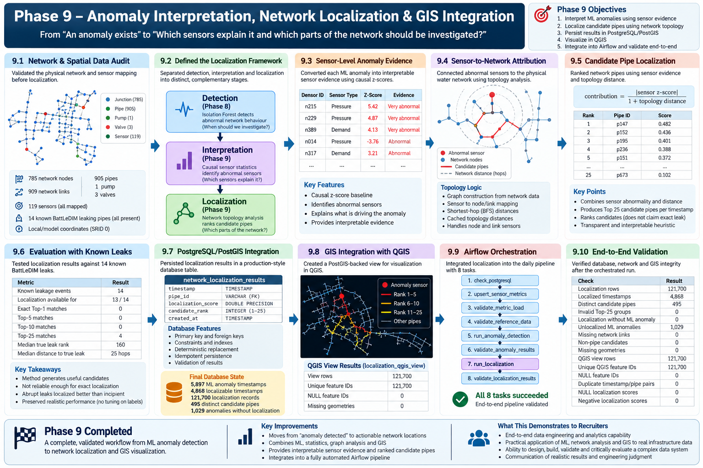

# Smart Water Network Intelligence Platform

## Overview

The **Smart Water Network Intelligence Platform** is an end-to-end data engineering, machine-learning, and geospatial analytics project for processing water-distribution sensor data, detecting abnormal network behaviour, and identifying network areas that may require investigation.

The platform uses historical **BattLeDIM / L-Town** water-network data to simulate continuous pressure, flow, tank-level, and demand measurements.

The implemented architecture combines:

- Apache Kafka for event ingestion;
- Apache Spark for stream processing;
- Parquet for historical event storage;
- PostgreSQL/PostGIS for operational and spatial data;
- Apache Airflow for workflow orchestration;
- scikit-learn for anomaly detection;
- graph/topology analysis for anomaly localization;
- QGIS for spatial visualization;
- Docker for reproducible execution environments.

The project demonstrates the progression from raw sensor measurements to operational network intelligence:

```text
Sensor Simulation
        ↓
Kafka Ingestion
        ↓
Spark Processing
        ↓
Parquet + PostgreSQL/PostGIS
        ↓
Airflow Orchestration
        ↓
Anomaly Detection
        ↓
Sensor-Level Interpretation
        ↓
Network Topology Analysis
        ↓
Candidate Pipe Localization
        ↓
PostGIS
        ↓
QGIS Visualization
```

> Anomalies indicate unusual network behaviour requiring investigation. They are not automatically treated as confirmed leaks, and localization results represent candidate network assets rather than guaranteed leaking pipes.

---

## Architecture

```text
BattLeDIM Historical SCADA Data
                │
                ▼
        Python Sensor Simulator
                │
                ▼
           Apache Kafka
      water-sensor-events
                │
                ▼
      Spark Structured Streaming
                │
         ┌──────┴──────┐
         ▼             ▼
      Parquet       PostgreSQL
     Historical       Staging
      Storage            │
                         ▼
                    Apache Airflow
                         │
                         ▼
                 PostgreSQL/PostGIS
                    Serving Layer
                         │
              ┌──────────┴──────────┐
              ▼                     ▼
     sensor_metrics_15min   network_anomaly_results
                                    │
                                    ▼
                            Sensor Interpretation
                                    │
                                    ▼
                            Network Topology
                                    │
                                    ▼
                      network_localization_results
                                    │
                                    ▼
                              PostGIS View
                                    │
                                    ▼
                                  QGIS
```

### Component Responsibilities

| Component | Responsibility |
|---|---|
| Python | Sensor simulation, feature engineering, anomaly analysis, localization |
| Apache Kafka | Streaming sensor-event ingestion |
| Apache Spark | Validation, event-time processing, aggregation, persistence |
| Parquet | Historical valid-event storage and rejected-event quarantine |
| PostgreSQL | Operational, serving, anomaly, and localization data |
| PostGIS | Network geometry and spatial serving |
| Apache Airflow | Scheduling, orchestration, retries, and validation |
| scikit-learn | Isolation Forest anomaly detection |
| Network topology | Sensor-to-network attribution and candidate-pipe ranking |
| QGIS | Spatial exploration of localization results |
| Docker | Reproducible infrastructure and analytical environments |

---

## Data Source

The project uses the **BattLeDIM 2018 dataset** together with the **L-Town EPANET water-distribution network model**.

L-Town is a benchmark network and should not be interpreted as a real Rwandan water network.

### SCADA Measurements

| Measurement | Sensors |
|---|---:|
| Pressure | 33 |
| Flow | 3 |
| Tank level | 1 |
| Demand | 82 |
| **Total** | **119** |

The 2018 SCADA data contains **105,120 timestamps at 5-minute intervals**, with 119 measurements at each timestamp.

### Network Reference Data

```text
Sensors          119
Network nodes    785
Network links    909

Pipes            905
Pump               1
Valves              3
```

All 119 sensors are mapped to network assets.

Network geometry uses the BattLeDIM/L-Town **local model coordinate system (SRID 0)**. No geographic CRS is assumed.

Known leakage information is kept separate from detector and localization inputs and is used only for evaluation.

Raw source data is preserved unchanged and excluded from Git.

---

## Streaming Data Pipeline

The Python simulator converts historical SCADA observations into chronological sensor events and publishes them to:

```text
water-sensor-events
```

Spark Structured Streaming performs:

```text
Kafka ingestion
      ↓
JSON parsing
      ↓
Schema validation
      ↓
Structural validation
      ↓
Event-time processing
      ↓
10-minute watermark
      ↓
15-minute sensor aggregation
      ↓
Parquet + PostgreSQL persistence
```

A controlled validation replay processed:

```text
1,428 sensor events
1,428 valid historical events
0 rejected events
476 staging metrics
476 serving metrics
```

Repeated serving-layer execution remains at **476 records**, demonstrating idempotent persistence for the validated workload.

---

# Phase 8 — Network Anomaly Detection

Phase 8 extended the platform from data engineering into **network-level anomaly intelligence**.


## Detection Approach

Two complementary detectors were implemented.

### Statistical Baseline

The explainable baseline uses causal weekly-deviation statistics.

A sensor is considered abnormal when:

```text
|z-score| >= 3
```

and a network anomaly is triggered when at least:

```text
15 of 119 sensors
```

are simultaneously abnormal.

Validated result:

```text
Anomaly timestamps    1,128
Anomaly rate            1.12%
```

### Isolation Forest

The unsupervised model uses 357 causal features:

```text
119 × 5-minute changes
119 × 1-hour changes
119 × weekly deviations
```

Configuration:

```text
n_estimators = 200
contamination = "auto"
random_state = 42
```

The anomaly threshold is fixed from the **99th percentile of training-period scores**, without using future scoring data or leakage labels.

Validated result:

```text
Threshold             0.521368
Anomaly timestamps       5,897
Anomaly rate               5.83%
```

## Ground-Truth Evaluation

Both detectors were evaluated against **14 known BattLeDIM leakage events**.

Leakage labels were not used for detector training, feature selection, or threshold tuning.

| Evaluation | Baseline | Isolation Forest |
|---|---:|---:|
| Anomaly timestamps | 1,128 | 5,897 |
| Anomaly rate | 1.12% | 5.83% |
| Alert within 24 h | 8 / 14 | 13 / 14 |
| Alert within 72 h | 12 / 14 | 14 / 14 |
| Mean first-alert delay | 30.08 h | 7.10 h |
| Median first-alert delay | 15.50 h | 4.79 h |
| Maximum first-alert delay | 107.25 h | 33.00 h |

Isolation Forest produced substantially earlier warnings, but with a higher alert burden.

The result is therefore treated as an **operational trade-off between earlier warning and alert volume**, rather than evidence that one detector is universally more accurate.

---

# Phase 9 — Anomaly Interpretation, Network Localization & GIS

Phase 9 extends anomaly detection into **interpretable spatial decision support**.



The objective is to move from:

```text
"An anomaly exists"
```

toward:

```text
"Which sensors explain the anomaly,
and which parts of the network should be investigated?"
```

## Sensor-Level Interpretation

Isolation Forest provides a network-level anomaly score but does not directly identify which sensor caused the anomaly.

The localization layer therefore uses causal statistical sensor evidence to identify abnormal measurements.

This deliberately separates:

```text
Detection
    ↓
Interpretation
    ↓
Localization
```

Isolation Forest determines **when the network should be investigated**, while sensor-level statistics provide interpretable evidence about **where abnormal behaviour is being observed**.

## Sensor-to-Network Attribution

The physical network is represented as a graph using its nodes and links.

The localization system implements:

- sensor-to-node/link mapping;
- graph construction from network topology;
- shortest-hop distance calculation;
- cached topology distances;
- node and link sensor attribution.

This connects abnormal sensor measurements to the surrounding physical network.

## Candidate Pipe Localization

Candidate pipes are ranked using a transparent heuristic combining sensor abnormality and network distance:

```text
contribution =
|sensor z-score|
─────────────────────────
1 + topology distance
```

The system persists the **Top 25 candidate pipes** for each localizable ML anomaly timestamp.

The ranking is an investigation aid and is **not interpreted as the probability that a pipe is leaking**.

## Localization Evaluation

The localization method was independently evaluated against the 14 known BattLeDIM leaking pipes.

| Metric | Result |
|---|---:|
| Known leakage events | 14 |
| Localization available | 13 / 14 |
| Exact Top-1 matches | 0 |
| Top-5 matches | 0 |
| Top-10 matches | 0 |
| Top-25 matches | 4 |
| Median true-pipe rank | 160 |
| Median Rank-1 distance to true pipe | 25 network hops |

The evaluation shows that the current topology-weighted heuristic can produce **candidate network assets**, but it is not reliable enough for exact-pipe leak localization.

The method was not retuned against the leakage labels after evaluation.

This limitation is preserved explicitly rather than overstating model performance.

---

## PostgreSQL/PostGIS Localization Layer

Localization results are persisted in:

```text
network_localization_results
```

with:

```text
timestamp
pipe_id
localization_score
candidate_rank
created_at
```

The table includes primary/foreign-key constraints, validation rules, indexes, and repeat-safe persistence.

Validated state:

```text
ML anomaly timestamps          5,897
Localized timestamps           4,868
Unlocalized anomalies          1,029
Localization records         121,700
Distinct candidate pipes         495
Candidates per timestamp           25
```

The 1,029 unlocalized anomalies did not contain sufficient qualifying sensor evidence. The system therefore does not force a location when evidence is insufficient.

---

## GIS Integration

Localization results are joined to PostGIS network geometry through:

```text
localization_qgis_view
```

The QGIS serving view contains:

```text
Rows                    121,700
Unique feature IDs      121,700
NULL feature IDs              0
Missing geometries            0
```

The QGIS project visualizes:

- the complete pipe network;
- anomaly-specific candidate pipes;
- candidate rank using graduated symbology;
- Top-5 candidate labels.

The project is stored under:

```text
gis/smart_water_localization.qgz
```

Because the source network uses local/model coordinates, the visualization intentionally avoids assigning an unsupported geographic CRS.

---

## Airflow Orchestration

The daily Airflow DAG now orchestrates the complete serving, anomaly-detection, and localization workflow:

```text
check_postgresql
        ↓
upsert_sensor_metrics
        ↓
validate_metric_load
        ↓
validate_reference_data
        ↓
run_anomaly_detection
        ↓
validate_anomaly_results
        ↓
run_localization
        ↓
validate_localization_results
```

Configuration:

```text
schedule       @daily
retries        2
retry delay    5 minutes
catchup        False
```

A controlled integrated execution successfully completed **all 8 tasks**.

The Airflow schedule orchestrates the workflow; it does not imply that Kafka itself only processes data once per day.

The validated anomaly/localization workload operates on the historical **5-minute BattLeDIM detector dataset**. It is not claimed to consume the separate 15-minute Spark serving table directly.

---

## End-to-End Validation

The final Phase 9 workflow was validated after execution through Airflow.

| Validation | Result |
|---|---:|
| Anomaly rows | 101,088 |
| ML anomaly timestamps | 5,897 |
| Localization rows | 121,700 |
| Localized timestamps | 4,868 |
| Distinct candidate pipes | 495 |
| Invalid Top-25 groups | 0 |
| Localization without ML anomaly | 0 |
| Missing network links | 0 |
| Non-pipe candidates | 0 |
| Missing geometries | 0 |
| Duplicate timestamp/pipe pairs | 0 |
| NULL localization scores | 0 |
| Negative localization scores | 0 |
| QGIS view rows | 121,700 |
| Unique QGIS feature IDs | 121,700 |

This validates the operational chain:

```text
Anomaly Detection
        ↓
Sensor Evidence
        ↓
Topology Attribution
        ↓
Candidate Pipe Ranking
        ↓
PostgreSQL/PostGIS
        ↓
QGIS
```

---

## Technology Stack

| Technology | Role |
|---|---|
| Python | Simulation, feature engineering, anomaly detection, localization |
| Pandas / NumPy | Data transformation and analytical processing |
| scikit-learn | Isolation Forest |
| Apache Kafka 4.1.1 | Streaming ingestion |
| Apache Spark 4.1.3 | Structured streaming and aggregation |
| PostgreSQL / PostGIS | Operational, analytical, and spatial storage |
| Parquet | Historical event storage |
| Apache Airflow 3.3.1 | Workflow orchestration and validation |
| QGIS 3.44 | Network and localization visualization |
| Docker / Docker Compose | Reproducible infrastructure and ML execution |
| Git / GitHub | Version control and project publication |

---

## Project Structure

```text
Smart-water-network-platform/
│
├── docs/
│   └── images/
│       ├── phase8/
│       │   └── phase8_anomaly_detection_overview.png
│       └── phase9/
│           └── phase9_localization_gis_overview.png
│
├── gis/
│   └── smart_water_localization.qgz
│
├── data/
│   ├── raw/
│   ├── reference/
│   ├── lake/
│   └── checkpoints/
│
├── infrastructure/
│   ├── airflow/
│   │   ├── dags/
│   │   │   └── smart_water_daily_pipeline.py
│   │   └── docker-compose.yml
│   ├── kafka/
│   ├── ml/
│   ├── postgres/
│   └── spark/
│
├── sql/
│   ├── 01_create_storage_schema.sql
│   ├── 02_upsert_sensor_metrics.sql
│   ├── 03_create_network_anomaly_results.sql
│   ├── 04_create_network_localization_results.sql
│   └── 05_create_localization_qgis_view.sql
│
├── src/
│   ├── anomaly_detection/
│   ├── localization/
│   ├── data/
│   ├── exploration/
│   ├── simulator/
│   └── streaming/
│
├── .gitignore
├── requirements.txt
└── README.md
```

Runtime files, credentials, generated lake data, Spark checkpoints, virtual environments, and Python caches are excluded from version control.

---

## Local Setup

The current implementation has been developed and validated on Windows using Docker Desktop.

### Prerequisites

- Git
- Python
- Docker Desktop with Docker Compose
- QGIS for spatial visualization

### Environment Configuration

Use:

```text
infrastructure/postgres/.env.example
```

as the template for:

```text
infrastructure/postgres/.env
```

The real `.env` file is excluded from Git.

### Create Shared Docker Network

```cmd
docker network create smart-water-network
```

### Start PostgreSQL/PostGIS

```cmd
docker compose --env-file infrastructure\postgres\.env -f infrastructure\postgres\docker-compose.yml up -d
```

### Initialize Database

```cmd
docker exec -i smart-water-postgres psql -U smart_water_user -d smart_water < sql\01_create_storage_schema.sql

docker exec -i smart-water-postgres psql -U smart_water_user -d smart_water < sql\02_upsert_sensor_metrics.sql

docker exec -i smart-water-postgres psql -U smart_water_user -d smart_water < sql\03_create_network_anomaly_results.sql

docker exec -i smart-water-postgres psql -U smart_water_user -d smart_water < sql\04_create_network_localization_results.sql

docker exec -i smart-water-postgres psql -U smart_water_user -d smart_water < sql\05_create_localization_qgis_view.sql
```

### Load Reference Data

```cmd
python -m src.data.load_reference_data
```

### Start Kafka

```cmd
docker compose -f infrastructure\kafka\docker-compose.yml up -d
```

### Replay Sensor Data

```cmd
python -m src.simulator.sensor_simulator
```

### Run Spark

```cmd
infrastructure\spark\run_spark_stream.cmd
```

### Build ML Environment

```cmd
docker build -f infrastructure\ml\Dockerfile -t smart-water-ml .
```

### Start Airflow

```cmd
docker compose --env-file infrastructure\postgres\.env -f infrastructure\airflow\docker-compose.yml up -d
```

The Airflow UI/API is exposed locally on port:

```text
8081
```

### Trigger Integrated Pipeline

```cmd
docker exec smart-water-airflow-scheduler airflow dags trigger smart_water_daily_pipeline
```

---

## Engineering Principles

The project follows several deliberate engineering principles:

**Separation of responsibilities**  
Kafka handles ingestion, Spark handles streaming transformations, PostgreSQL/PostGIS provides structured and spatial storage, Airflow orchestrates workflows, and the ML environment performs anomaly and localization workloads.

**Causal analytics**  
Anomaly features and sensor evidence avoid using future observations.

**Ground-truth separation**  
Leakage labels are used for evaluation rather than detector/localization input or threshold tuning.

**Baseline before ML**  
An explainable statistical detector provides a reference before evaluating additional ML complexity.

**Evidence before claims**  
Anomalies are not automatically classified as leaks, and candidate pipes are not presented as confirmed leak locations.

**Idempotent persistence**  
Repeated serving, anomaly, and localization execution does not create duplicate analytical records.

**Data-quality validation**  
Validation is performed between major pipeline stages and after final persistence.

**Raw-data preservation**  
Source datasets are never modified in place.

**Secrets management**  
Credentials remain in ignored environment files.

**Incremental architecture**  
Technologies are introduced only when they have a clear responsibility.

---

## Project Progress

| Phase | Scope | Status |
|---|---|---|
| 1 | Project design | ✅ |
| 2 | Data acquisition and understanding | ✅ |
| 3 | Python sensor simulator | ✅ |
| 4 | Kafka streaming ingestion | ✅ |
| 5 | Spark Structured Streaming | ✅ |
| 6 | Persistent storage | ✅ |
| 7 | Airflow orchestration and integration | ✅ |
| 8 | Network anomaly detection | ✅ |
| 9 | Anomaly interpretation, localization and GIS | ✅ |
| 10 | Operational analytics / dashboards | Planned |
| Future | Selected AWS deployment | Planned |

---

## Current Capabilities

The platform currently demonstrates:

```text
Data Engineering
├── event simulation
├── Kafka ingestion
├── Spark processing
├── Parquet storage
├── PostgreSQL serving
└── Airflow orchestration

Machine Learning & Analytics
├── causal feature engineering
├── statistical anomaly detection
├── Isolation Forest
├── ground-truth evaluation
└── sensor-level anomaly interpretation

Network Intelligence
├── graph construction
├── sensor-to-network attribution
├── shortest-hop analysis
└── candidate-pipe ranking

Geospatial Analytics
├── PostGIS network geometry
├── spatial serving views
└── QGIS visualization

Engineering Quality
├── Dockerized execution
├── data-quality validation
├── idempotent persistence
├── reproducible workflows
└── explicit model limitations
```

---

## Next Development Stage

With the core data pipeline, anomaly detection, interpretation, network localization, PostGIS integration, and QGIS visualization validated, the next stage will focus on **operational analytics and presentation**.

Potential extensions include:

- operational dashboards;
- anomaly and sensor trend visualization;
- network monitoring KPIs;
- automated testing;
- stronger hydraulic/spatial localization methods;
- selected AWS services where they provide clear architectural value.

Future localization improvements will be evaluated independently rather than tuned to make the existing BattLeDIM ground-truth results appear stronger.

---

## Reproducibility

The repository excludes machine-specific, generated, and sensitive files including:

```text
.env
*.env
venv/
__pycache__/
*.pyc
data/raw/
data/lake/
data/checkpoints/
```

`.env.example` documents required configuration without exposing credentials.

The repository focuses on source code, infrastructure definitions, SQL, analytical logic, GIS configuration, and documentation required to understand and reproduce the architecture.

---

## Author

**GATERA Emile**  
Civil & Water Resources Engineer | Data Engineering & Analytics

This project combines water-infrastructure domain knowledge with practical data engineering, streaming systems, database design, workflow orchestration, machine learning, network analysis, and geospatial analytics.