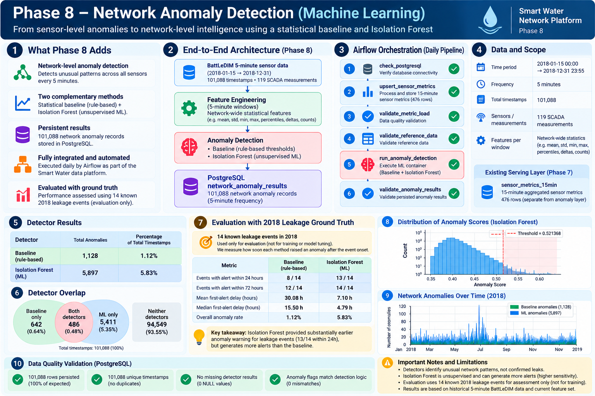

# Smart Water Network Intelligence Platform

## Overview

The **Smart Water Network Intelligence Platform** is an end-to-end data engineering and machine-learning project for processing water-distribution sensor data, producing operational metrics, and identifying abnormal network behaviour.

The platform uses historical **BattLeDIM** water-network data to simulate continuous pressure, flow, tank-level, and demand measurements. These measurements are processed through a local streaming and analytics architecture built with **Apache Kafka, Apache Spark, PostgreSQL/PostGIS, Parquet, Apache Airflow, Docker, and scikit-learn**.

The project demonstrates a complete engineering workflow:

```text
simulation
    ↓
stream ingestion
    ↓
stream processing
    ↓
persistent storage
    ↓
workflow orchestration
    ↓
data-quality validation
    ↓
feature engineering
    ↓
anomaly detection
    ↓
evaluation and persistence
```

The anomaly-detection layer combines an explainable statistical baseline with an unsupervised **Isolation Forest** model.

> Detected anomalies represent unusual network behaviour requiring investigation. They are not automatically treated as confirmed leaks.

---

## Architecture

```text
BattLeDIM Historical SCADA Data
              │
              ▼
     Python Sensor Simulator
              │
              ▼
         Apache Kafka
     water-sensor-events
              │
              ▼
    Spark Structured Streaming
              │
        ┌─────┴─────┐
        │           │
        ▼           ▼
     Parquet     PostgreSQL
   Historical      Staging
     Storage          │
                      ▼
                 Apache Airflow
                      │
                      ▼
              PostgreSQL / PostGIS
                Serving Layer
                      │
                      ├── sensor_metrics_15min
                      │
                      ▼
              Phase 8 ML Workload
                      │
                      ▼
               Feature Engineering
                      │
              ┌───────┴────────┐
              ▼                ▼
        Statistical        Isolation
          Baseline          Forest
              │                │
              └───────┬────────┘
                      ▼
                PostgreSQL
          network_anomaly_results
```

### Component Responsibilities

| Component | Responsibility |
|---|---|
| Python simulator | Replays historical SCADA measurements as chronological sensor events |
| Apache Kafka | Streaming event ingestion |
| Spark Structured Streaming | Parses, validates, aggregates, and persists streaming data |
| Parquet | Historical valid-event storage and rejected-event quarantine |
| PostgreSQL | Reference data, staging metrics, serving metrics, and anomaly results |
| PostGIS | Spatial capability for future network/GIS analysis |
| Apache Airflow | Workflow scheduling, orchestration, and validation |
| scikit-learn | Isolation Forest anomaly detection |
| Docker | Isolated and reproducible infrastructure and ML environments |

Selected components may later be extended to AWS after the local architecture has been fully developed and validated.

---

## Current Implementation

The current platform supports:

- historical BattLeDIM sensor-data replay;
- Kafka-based streaming ingestion;
- explicit JSON schema parsing;
- structural event validation;
- Spark event-time processing;
- a 10-minute watermark;
- 15-minute sensor-level aggregation;
- Parquet historical event storage;
- rejected-event quarantine;
- persistent Spark checkpoints;
- PostgreSQL/PostGIS reference and serving storage;
- idempotent staging-to-serving upserts;
- daily Airflow orchestration and retry handling;
- serving and reference-data validation;
- causal anomaly feature engineering;
- statistical network-level anomaly detection;
- unsupervised Isolation Forest anomaly detection;
- evaluation against independent leakage ground truth;
- PostgreSQL anomaly-result persistence;
- automated anomaly execution and validation through Airflow.

A controlled one-hour streaming replay processes:

```text
12 timestamps × 119 sensors = 1,428 sensor events
```

and produces:

```text
476 sensor/window metric records
```

across four 15-minute windows.

The Phase 8 anomaly workload independently evaluates the historical 5-minute BattLeDIM data across:

```text
101,088 detector timestamps
```

from **2018-01-15 00:00** through **2018-12-31 23:55**.

---

## Data Source

The project uses the **BattLeDIM 2018 dataset** together with the **L-Town EPANET water-distribution network model**.

BattLeDIM provides a benchmark environment for water-distribution monitoring and leakage-detection research.

The L-Town network is a hypothetical benchmark network and should not be interpreted as a real Rwandan water network.

### Sensor Measurements

| Measurement | Sensors | Unit |
|---|---:|---|
| Pressure | 33 | m |
| Flow | 3 | m³/h |
| Tank level | 1 | m |
| Demand | 82 | L/h |
| **Total** | **119** | — |

The SCADA datasets contain **105,120 timestamps** at 5-minute intervals throughout 2018.

Each timestamp contains **119 SCADA measurements**.

### Network Reference Data

```text
Sensors          119
Network nodes    785
Network links    909
```

BattLeDIM leakage ground truth is kept separate from detector inputs. It is used only after detection for independent evaluation.

Raw source data is preserved unchanged and excluded from Git version control.

---

## Sensor Event Contract

Kafka messages use the following logical structure:

```text
event_id
event_time
sensor_id
sensor_type
value
unit
```

Supported measurement categories are:

```text
pressure → m
flow     → m3/h
level    → m
demand   → L/h
```

Kafka message keys use:

```text
<sensor_type>:<sensor_id>
```

Example:

```text
pressure:n1
```

Structural validation and anomaly detection are deliberately separated.

A structurally valid measurement is not automatically normal, and an anomalous measurement is not automatically a confirmed leak.

---

## Streaming Processing

Spark Structured Streaming consumes:

```text
water-sensor-events
```

and performs:

```text
Kafka ingestion
      ↓
JSON parsing
      ↓
Schema validation
      ↓
Structural validation
      ↓
Event-time processing
      ↓
10-minute watermark
      ↓
15-minute sensor aggregation
      ↓
Parquet + PostgreSQL persistence
```

Spark runs locally inside Docker and communicates through the project's shared Docker network.

The controlled execution uses an `availableNow` trigger. Spark processes the events currently available in Kafka and terminates cleanly.

---

## Storage Architecture

### Parquet Historical Layer

Valid sensor events are written to:

```text
data/lake/sensor_events/
```

Rejected events are quarantined separately:

```text
data/lake/rejected_sensor_events/
```

The validated controlled replay produced:

```text
Valid historical events    1,428
Rejected events                 0
```

### PostgreSQL / PostGIS Layer

PostgreSQL stores:

- sensor metadata;
- network nodes;
- network links;
- 15-minute sensor metrics;
- metric staging data;
- network-level anomaly results.

Validated Phase 7 serving data:

```text
metrics_staging    476
metrics_serving    476
```

The staging-to-serving procedure is idempotent. Reprocessing the same records does not create duplicate serving metrics.

Phase 8 additionally stores:

```text
network_anomaly_results    101,088
```

with one network-level detector result per 5-minute timestamp.

PostGIS remains available for future spatial analysis and anomaly localization work.

---

## Network Anomaly Detection — Phase 8

Phase 8 extends the platform from data movement and serving into **network-level anomaly intelligence**.



### Detection Problem

The detector uses only SCADA measurements and derived historical features to identify unusual network behaviour.

Known leakage information is **not supplied to either detector**.

The 14 known leakage events overlapping 2018 are retained exclusively for evaluation.

### Feature Engineering

The detector-ready dataset contains causal features derived from the 119 SCADA measurements:

- raw measurements;
- 5-minute changes;
- 1-hour changes;
- weekly deviations;
- temporal context.

Weekly deviations use only the corresponding previous-week observation, preventing future-data leakage.

After the one-week warm-up period:

```text
Detector-ready rows    103,104
Detector columns           479
Missing values               0
```

### Statistical Baseline

The baseline provides an explainable reference detector.

For each weekly-deviation sensor feature:

1. causal expanding mean and standard deviation are calculated;
2. the current observation is excluded from its own reference statistics;
3. a sensor is anomalous when `|z| >= 3`;
4. the network is anomalous when at least **15 of 119 sensors** are anomalous simultaneously.

Validated results:

```text
Anomaly timestamps    1,128
Anomaly rate           1.12%
```

### Isolation Forest

The unsupervised ML detector uses **357 features**:

```text
119 × 5-minute changes
119 × 1-hour changes
119 × weekly deviations
```

The model configuration is:

```text
IsolationForest
n_estimators = 200
contamination = "auto"
random_state = 42
```

The anomaly threshold is fixed from the **99th percentile of training-period anomaly scores**, rather than from the future scoring distribution or leakage labels.

Validated threshold:

```text
0.521368
```

Results:

```text
Anomaly timestamps    5,897
Anomaly rate           5.83%
```

---

## Leakage Ground-Truth Evaluation

Detector performance was evaluated against **14 known 2018 BattLeDIM leakage events**.

Ground truth was used only for evaluation—not for detector training, threshold selection, or feature tuning.

Because at least one known leakage was active throughout the scoring period, a conventional leak-active versus no-leak false-positive comparison would not be valid for this dataset. Evaluation therefore focuses on whether alerts occur near configured leakage onset and how quickly they appear.

### Baseline vs Isolation Forest

| Evaluation | Statistical Baseline | Isolation Forest |
|---|---:|---:|
| Anomaly timestamps | 1,128 | 5,897 |
| Anomaly rate | 1.12% | 5.83% |
| Alert within 24 hours | 8 / 14 | 13 / 14 |
| Alert within 72 hours | 12 / 14 | 14 / 14 |
| Abrupt events within 24h | 4 / 6 | 6 / 6 |
| Incipient events within 24h | 4 / 8 | 7 / 8 |
| Mean first-alert delay | 30.08 h | 7.10 h |
| Median first-alert delay | 15.50 h | 4.79 h |
| Maximum first-alert delay | 107.25 h | 33.00 h |

Detector overlap across the evaluation period:

```text
Both detectors       486
Baseline only        642
Isolation Forest   5,411
Neither           94,549
```

### Interpretation

Isolation Forest produced substantially earlier anomaly/onset warnings in this BattLeDIM evaluation.

However, it also generated a substantially larger alert volume:

```text
Baseline          1.12%
Isolation Forest  5.83%
```

The result is therefore treated as an **operational trade-off between earlier warning and alert burden**, rather than evidence that one detector is universally more accurate.

An alert near a configured leakage onset also does not prove that the specific leakage caused that alert, particularly when multiple leakage events overlap.

The current detector identifies **network-level anomalies**. It does not yet identify the exact leaking pipe.

---

## Airflow Orchestration

The DAG is:

```text
smart_water_daily_pipeline
```

and now orchestrates both the serving-layer workflow and Phase 8 anomaly workload:

```text
check_postgresql
        ↓
upsert_sensor_metrics
        ↓
validate_metric_load
        ↓
validate_reference_data
        ↓
run_anomaly_detection
        ↓
validate_anomaly_results
```

### Task Responsibilities

**`check_postgresql`**

Verifies connectivity to the Smart Water PostgreSQL database.

**`upsert_sensor_metrics`**

Merges staged Spark metrics into the 15-minute serving layer.

**`validate_metric_load`**

Checks that serving metrics are present.

**`validate_reference_data`**

Checks required sensor and network reference data.

**`run_anomaly_detection`**

Launches the dedicated `smart-water-ml` Docker environment and executes the validated 5-minute baseline and Isolation Forest workload.

**`validate_anomaly_results`**

Validates persisted anomaly results, timestamp uniqueness, detector outputs, and required fields.

### Scheduling and Retries

The DAG runs:

```text
@daily
```

which corresponds to:

```text
00:00 UTC
```

with:

```text
retries      = 2
retry_delay  = 5 minutes
catchup      = False
```

The Airflow schedule orchestrates the workflow; it does not mean Kafka itself only processes data once per day.

### Cadence Separation

The platform currently contains two intentionally separate analytical layers:

```text
sensor_metrics_15min
→ 15-minute Spark serving metrics

network_anomaly_results
→ 5-minute BattLeDIM anomaly results
```

The validated anomaly model is **not claimed to consume `sensor_metrics_15min`**.

Changing the detector to operate directly on 15-minute aggregates would change its input distribution and would require new model evaluation.

---

## End-to-End Validation

### Streaming and Serving Layer

```text
BattLeDIM source
      ↓
Python simulator
      ↓
1,428 sensor events
      ↓
Kafka
      ↓
Spark Structured Streaming
      ↓
1,428 valid Parquet events
      ↓
476 PostgreSQL staging metrics
      ↓
Airflow
      ↓
476 PostgreSQL serving metrics
```

Repeat execution leaves the serving-layer count at:

```text
476
```

rather than creating duplicate records.

### Anomaly Layer

The integrated Airflow execution successfully completed all six tasks.

Final PostgreSQL validation:

| Validation | Result |
|---|---:|
| Anomaly rows | 101,088 |
| Unique timestamps | 101,088 |
| Missing detector results | 0 |
| Baseline anomalies | 1,128 |
| Isolation Forest anomalies | 5,897 |
| Baseline flag mismatches | 0 |
| ML flag mismatches | 0 |
| Both detectors | 486 |
| Baseline only | 642 |
| ML only | 5,411 |
| Neither | 94,549 |

Repeated anomaly persistence remains at:

```text
101,088 unique timestamps
```

confirming repeat-safe upsert behaviour for the validated historical workload.

---

## Streaming Checkpoints

Spark maintains checkpoint state under:

```text
data/checkpoints/events_archive/
data/checkpoints/metrics/
```

Checkpoint restart/resume behaviour has been validated.

Restarting Spark using the same checkpoint state did not duplicate historical Parquet records during the controlled test.

This demonstrates checkpoint-based recovery in the current local implementation and is not presented as a production exactly-once guarantee.

Generated lake data and checkpoints are excluded from Git.

---

## Project Progress

### Phase 1 — Project Design ✅

Defined the business problem, users, architecture, technology responsibilities, and anomaly-detection concept.

### Phase 2 — Data Acquisition & Understanding ✅

Validated BattLeDIM SCADA data, timestamps, sensors, leakage ground truth, L-Town topology, and event-contract requirements.

### Phase 3 — Python Sensor Simulator ✅

Built a reusable simulator that converts historical SCADA measurements into chronological sensor events.

### Phase 4 — Apache Kafka Streaming Ingestion ✅

Implemented Kafka ingestion, event serialization, sensor-based message keys, simulator integration, and consumer validation.

### Phase 5 — Spark Structured Streaming ✅

Implemented Kafka-to-Spark processing, schema validation, rejected-event handling, event-time processing, watermarking, and 15-minute sensor metrics.

### Phase 6 — Persistent Storage ✅

Implemented PostgreSQL/PostGIS storage, Parquet historical storage, reference-data loading, staging, idempotent serving upserts, rejected-event quarantine, and Spark checkpoints.

### Phase 7 — Workflow Orchestration & End-to-End Integration ✅

Implemented Airflow 3.3.1 orchestration, daily scheduling, retries, database checks, serving-layer validation, and complete source-to-serving validation.

### Phase 8 — Network Anomaly Detection & Leakage Intelligence ✅

Implemented and validated:

- leakage ground-truth investigation;
- anomaly-detection problem definition;
- exploratory network-behaviour analysis;
- causal feature engineering;
- statistical baseline detector;
- unsupervised Isolation Forest;
- independent ground-truth evaluation;
- detector comparison and onset-delay analysis;
- PostgreSQL anomaly-result persistence;
- idempotent anomaly upserts;
- dedicated Docker ML environment;
- Airflow ML orchestration;
- anomaly-result data-quality checks;
- integrated end-to-end validation.

---

## Technology Stack

| Technology | Role |
|---|---|
| Python | Simulation, data processing, feature engineering, anomaly detection |
| Pandas / NumPy | Data manipulation and feature engineering |
| scikit-learn | Isolation Forest anomaly detection |
| Apache Kafka 4.1.1 | Streaming ingestion |
| Apache Spark 4.1.3 | Structured streaming and aggregation |
| PostgreSQL / PostGIS | Operational, anomaly, and spatial storage |
| Parquet | Historical event storage |
| Apache Airflow 3.3.1 | Workflow orchestration and validation |
| Docker / Docker Compose | Infrastructure and ML environment isolation |
| Git / GitHub | Version control and project publication |

### Planned as Requirements Are Introduced

Future phases may introduce:

- anomaly localization and feature attribution;
- GIS/network analysis;
- operational dashboards;
- Power BI visualization;
- automated testing;
- selected AWS services.

Additional technologies will only be introduced where they have a clear architectural responsibility.

---

## Project Structure

```text
Smart-water-network-platform/
│
├── Docs/
│   ├── project_design.md
│   ├── data_understanding.md
│   └── data_contract.md
│
├── docs/
│   └── images/
│       └── phase8/
│           └── phase8_anomaly_detection_overview.png
│
├── data/
│   ├── raw/
│   ├── reference/
│   ├── lake/
│   └── checkpoints/
│
├── infrastructure/
│   ├── airflow/
│   │   ├── dags/
│   │   │   └── smart_water_daily_pipeline.py
│   │   └── docker-compose.yml
│   ├── kafka/
│   │   └── docker-compose.yml
│   ├── ml/
│   │   ├── Dockerfile
│   │   └── requirements.txt
│   ├── postgres/
│   │   ├── docker-compose.yml
│   │   └── .env.example
│   └── spark/
│       └── run_spark_stream.cmd
│
├── sql/
│   ├── 01_create_storage_schema.sql
│   ├── 02_upsert_sensor_metrics.sql
│   └── 03_create_network_anomaly_results.sql
│
├── src/
│   ├── anomaly_detection/
│   │   ├── feature_engineering.py
│   │   ├── baseline_detector.py
│   │   ├── isolation_forest_detector.py
│   │   ├── evaluation.py
│   │   └── anomaly_persistence.py
│   ├── data/
│   ├── exploration/
│   ├── simulator/
│   └── streaming/
│
├── .gitignore
├── requirements.txt
└── README.md
```

Runtime files such as `.env`, virtual environments, generated lake data, Spark checkpoints, and Python cache files are excluded from version control.

---

## Local Setup

The current implementation is developed and validated on Windows using Docker Desktop.

### Prerequisites

Install:

- Git;
- Python;
- Docker Desktop with Docker Compose.

Clone the repository and create a Python virtual environment.

Install the main project requirements:

```cmd
pip install -r requirements.txt
```

### Environment Configuration

Use:

```text
infrastructure/postgres/.env.example
```

as the template for:

```text
infrastructure/postgres/.env
```

The real `.env` file is excluded from Git.

### Create the Shared Docker Network

```cmd
docker network create smart-water-network
```

### Start PostgreSQL / PostGIS

```cmd
docker compose --env-file infrastructure\postgres\.env -f infrastructure\postgres\docker-compose.yml up -d
```

### Initialize PostgreSQL

Create the storage schema:

```cmd
docker exec -i smart-water-postgres psql -U smart_water_user -d smart_water < sql\01_create_storage_schema.sql
```

Install the metric upsert procedure:

```cmd
docker exec -i smart-water-postgres psql -U smart_water_user -d smart_water < sql\02_upsert_sensor_metrics.sql
```

Create the anomaly-result table:

```cmd
docker exec -i smart-water-postgres psql -U smart_water_user -d smart_water < sql\03_create_network_anomaly_results.sql
```

Load reference data:

```cmd
python -m src.data.load_reference_data
```

### Start Kafka

```cmd
docker compose -f infrastructure\kafka\docker-compose.yml up -d
```

### Replay Sensor Data

```cmd
python -m src.simulator.sensor_simulator
```

### Run Spark

```cmd
infrastructure\spark\run_spark_stream.cmd
```

### Build the ML Environment

```cmd
docker build -f infrastructure\ml\Dockerfile -t smart-water-ml .
```

### Start Airflow

```cmd
docker compose --env-file infrastructure\postgres\.env -f infrastructure\airflow\docker-compose.yml up -d
```

The Airflow API/UI is exposed locally on port:

```text
8081
```

### Trigger the Integrated Pipeline

```cmd
docker exec smart-water-airflow-scheduler airflow dags trigger smart_water_daily_pipeline
```

Airflow executes:

```text
database connectivity
        ↓
metric upsert
        ↓
metric validation
        ↓
reference-data validation
        ↓
anomaly detection
        ↓
anomaly-result validation
```

---

## Reproducibility and Repository Hygiene

The repository excludes machine-specific, generated, and sensitive files, including:

```text
.env
*.env
venv/
__pycache__/
*.pyc
data/raw/
data/lake/
data/checkpoints/
```

`.env.example` documents required configuration without exposing credentials.

Raw BattLeDIM source datasets are not committed.

The repository therefore focuses on source code, infrastructure configuration, SQL definitions, documentation, and reproducible analytical logic.

---

## Engineering Principles

**Separation of responsibilities**
Kafka handles ingestion, Spark handles streaming transformations, PostgreSQL serves structured data, Parquet retains historical events, Airflow orchestrates workflows, and the dedicated ML environment performs anomaly detection.

**Raw-data preservation**
Source datasets are not modified in place.

**Explicit data contracts**
Sensor events have defined fields, types, categories, and units.

**Causal feature engineering**
Historical anomaly features avoid using future observations.

**Ground-truth separation**
Leakage labels are used for evaluation rather than detector input or threshold tuning.

**Baseline before ML**
An explainable statistical detector provides a reference before evaluating additional ML complexity.

**Idempotent persistence**
Repeated serving and anomaly upserts do not create duplicate records.

**Checkpoint-based recovery**
Spark checkpoint state supports controlled restart/resume behaviour.

**Secrets management**
Credentials remain in ignored environment files.

**Incremental architecture**
Technologies are introduced only when they have a clear responsibility.

---

## Development Roadmap

```text
Understand source data                         ✅
        ↓
Define sensor event contract                   ✅
        ↓
Simulate sensor events                         ✅
        ↓
Build Kafka streaming ingestion                ✅
        ↓
Process streams with Spark                     ✅
        ↓
Persist historical and operational data        ✅
        ↓
Orchestrate and validate workflows             ✅
        ↓
Develop and evaluate anomaly detection          ✅
        ↓
Persist and orchestrate anomaly intelligence    ✅
        ↓
Add analytics and spatial context
        ↓
Build operational dashboards
        ↓
Extend selected components to AWS
```

---

## Next Phase

With streaming, persistence, orchestration, and network-level anomaly detection now validated, the next development stage will focus on turning anomaly results into more interpretable operational intelligence.

Potential extensions include:

- sensor/feature contribution analysis;
- anomaly localization;
- network topology and GIS integration;
- spatial visualization using PostGIS/QGIS;
- operational dashboards;
- automated testing;
- selected AWS deployment and managed services.

The sequence will remain evidence-driven: **detection → interpretation/localization → visualization**.

---

## Documentation

Detailed project decisions are maintained under `Docs/`, while README visuals are stored under `docs/images/`.

The README provides the high-level engineering and analytical view; detailed investigations remain in the relevant technical documentation and source modules.

---

## Author

**GATERA Emile**
Civil & Water Resources Engineer | Data Engineering & Analytics

This project combines water-infrastructure domain knowledge with practical experience in data engineering, streaming systems, database design, workflow orchestration, machine learning, and future geospatial analytics.
